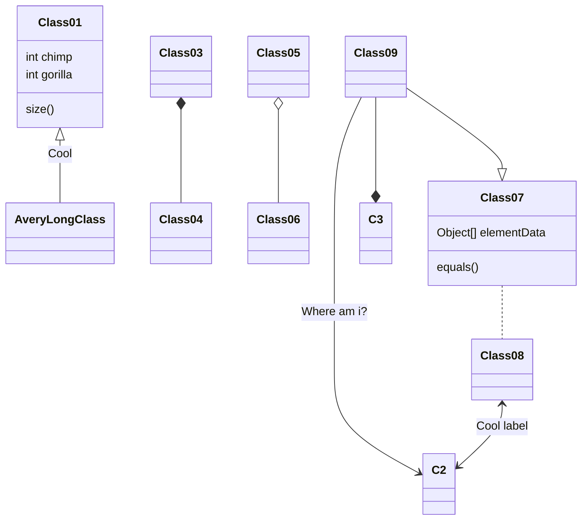
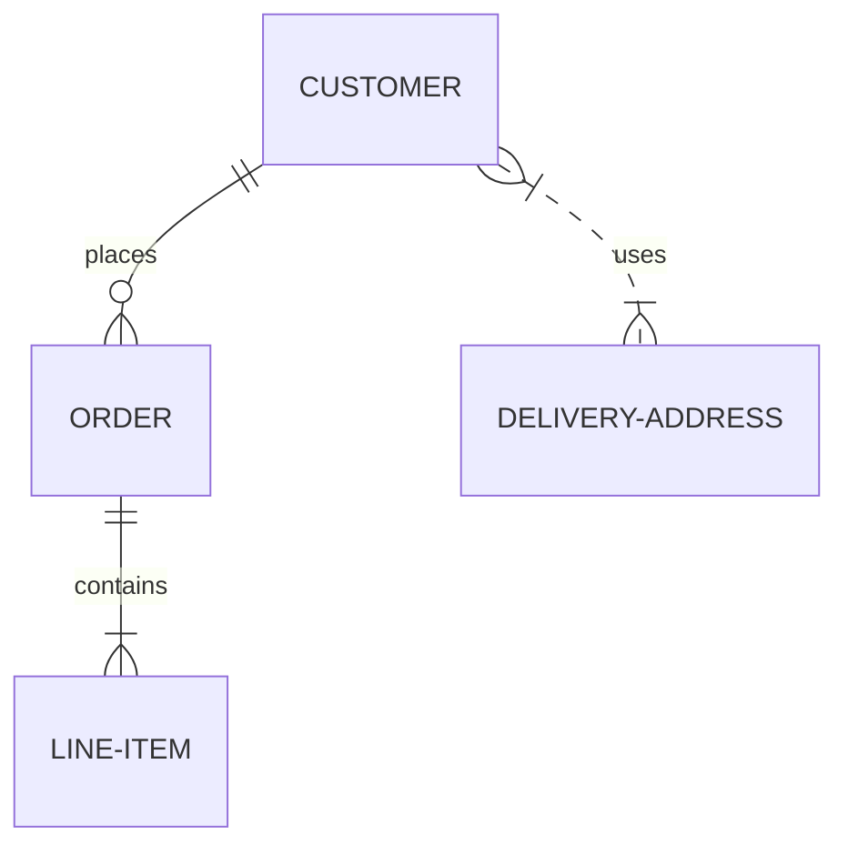
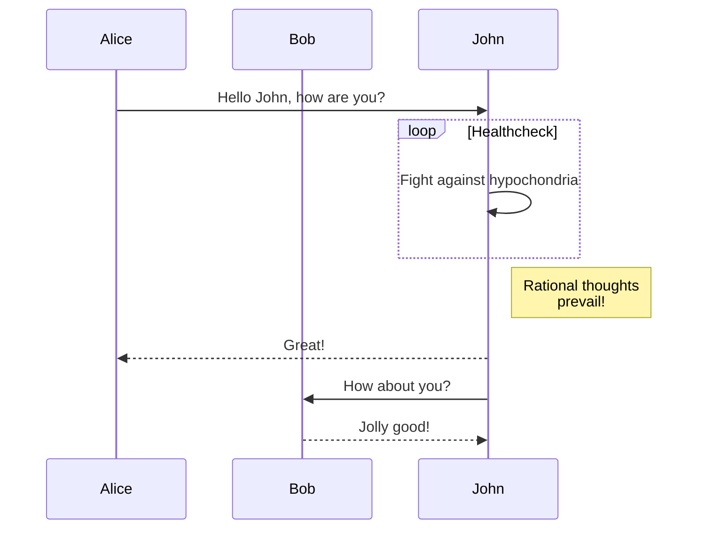

# Mermaid

[Mermaid](https://mermaid-js.github.io/mermaid/#/) lets you create diagrams and visualizations using text and code.

Some solutions such as GitHub and Azure DevOps also allow you to include Mermaid-syntax diagrams directly into your Markdown-based documentation:

You can use Mermaid to describe different views on your architecture. 

For example you can create class diagrams to describe static aspects of your architecture...

... or entity-relation diagrams to describe your application domain...

...or you can use sequence diagrams to describe dynamic aspects of your architecture:

