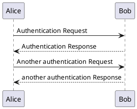

# PlantUML

[PlantUML](https://plantuml.com/) suppports generating visual diagrams from a textual description.

You can use PlantUML to describe different views on your architecture. 

This includes the ability to use Simon Browns C4 Model [container diagrams](https://github.com/mattjhayes/PlantUML-Examples/tree/master/docs/Examples) describing static aspects of your architecture

```plantuml
@startuml
!include https://raw.githubusercontent.com/plantuml-stdlib/C4-PlantUML/master/C4_Container.puml

' caption Context Diagram for Horrendous Hats (HH) Website

LAYOUT_WITH_LEGEND()

Person_Ext(customer, "Customer", "A customer wanting to buy a horrendous hat")

System(site, "eComm System", "Displays hats for sale, takes orders and payments")
System(fulfil, "Fulfilment System", "Fulfilment system that tracks inventory and ships orders to customers")

System_Ext(payments, "Payment Gateway", "Provides payment service") 

Rel(customer, site, "Orders hat using")
Rel(site, payments, "Redirects payment to")
Rel(site, fulfil, "Sends order to")
Rel(fulfil, site, "Lists hats for sale")
Rel(fulfil, customer, "Ships hat to")
Rel(fulfil, customer, "Emails invoice to")

@enduml
```


or using sequence diagrams to describe dynamic aspects



